## Part 1. Готовый докер

> English version: [Part1.md](../eng/Part1.md)

В данной части рассматривается работа с готовым Docker-образом Nginx: загрузка образа, запуск контейнера, просмотр его параметров и публикация портов.

## 1.1. Загрузка образа Nginx

Загрузим официальный образ Nginx из Docker Hub:

```bash
docker pull nginx
```

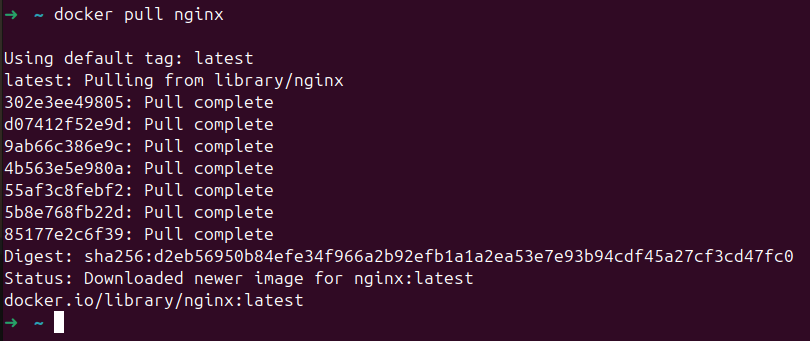

---

## 1.2. Просмотр локальных образов

Проверим, что образ был успешно загружен:

```bash
docker images
```

В списке локальных образов присутствует образ `nginx`.

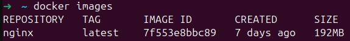

---

## 1.3. Создание и запуск контейнера

Создадим контейнер на основе образа `nginx` и запустим его в фоновом режиме:

```bash
docker run -d --name my-nginx nginx
```

Параметры команды:

* `-d` — запуск контейнера в фоновом режиме;
* `--name my-nginx` — имя создаваемого контейнера.

В результате команда возвращает идентификатор контейнера.

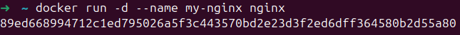

---

## 1.4. Проверка состояния контейнера

Проверим список запущенных контейнеров:

```bash
docker ps
```

Контейнер `my-nginx` присутствует в списке и имеет статус `Up`.

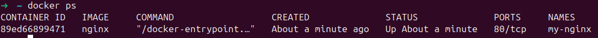

---

## 1.5. Просмотр информации о контейнере

Получим подробную информацию о контейнере:

```bash
docker inspect my-nginx
```

Команда выводит параметры контейнера в формате JSON.

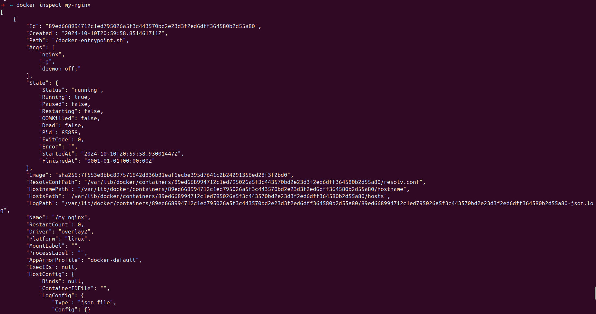

---

## 1.6. Анализ параметров контейнера

### Замапленные порты

Проверим опубликованные порты контейнера:

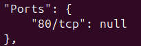

В данном случае опубликован порт:

```text
80/tcp
```

### IP-адрес контейнера

IP-адрес контейнера можно найти в выводе `docker inspect`.

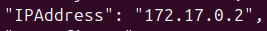

IP-адрес контейнера:

```text
172.17.0.2
```

### Размер контейнера

Размер контейнера определим с помощью команды:

```bash
docker ps -s
```

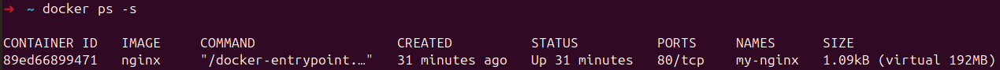

Размер контейнера:

```text
1.09 kB
```

---

## 1.7. Остановка контейнера

Остановим контейнер:

```bash
docker stop my-nginx
````

После остановки проверим список запущенных контейнеров:

```bash
docker ps
```

Контейнер отсутствует в списке запущенных, что подтверждает его успешную остановку.

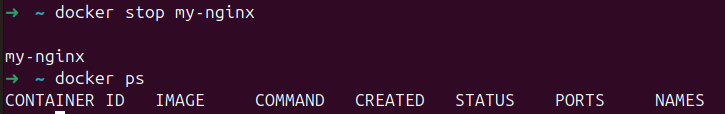

---

## 1.8. Запуск контейнера с публикацией портов

Создадим новый контейнер с публикацией портов 80 и 443 на хостовой системе:

```bash
docker run -d -p 80:80 -p 443:443 nginx
```

Параметр `-p` связывает порт хостовой системы с портом внутри контейнера в формате:

```text
<порт_хоста>:<порт_контейнера>
```

В данном случае опубликованы порты:

* `80:80`
* `443:443`

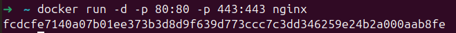

---

## 1.9. Проверка доступности веб-сервера

Проверим работу Nginx через браузер, открыв адрес:

```text
http://localhost:80
```

Отображается стандартная стартовая страница Nginx.

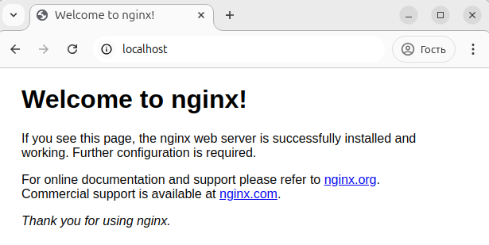

---

## 1.10. Перезапуск контейнера

Перезапустим контейнер:

```bash
docker restart <container_id>
```

После выполнения команды проверим список запущенных контейнеров:

```bash
docker ps
```

Контейнер снова находится в состоянии `Up`, что подтверждает успешный перезапуск.

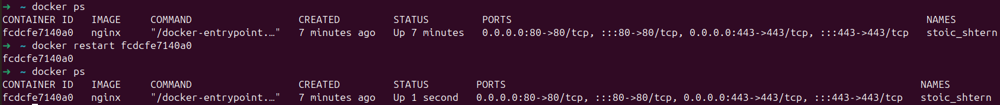

---

## Итог

В ходе работы был загружен официальный образ Nginx, создан и запущен контейнер, изучены его параметры с помощью `docker inspect`, настроена публикация портов и проверена доступность веб-сервера через браузер.


## Навигация

↑ [README_ru](../../README_ru.md)

→ [Part 2. Операции с контейнером](Part2_ru.md)

---