## Part 2. Операции с контейнером

> English version: [../eng/Part2.md](Part2.md)

### Читаем конфигурационный файл *nginx.conf* внутри докер контейнера через команду `exec`

> Команда `docker exec` используется для выполнения команд в уже запущенном контейнере Docker. Это позволяет взаимодействовать с контейнером, запускать команды, просматривать или изменять файлы и выполнять другие задачи без необходимости останавливать контейнер.
> 
> Перед её использованием стоит убедиться, что контейнер работает, иначе она не запустится.

> Флаг `-it` позволяет работать в интерактивном режиме, т.е. даёт возможность взаимодействовать с контейнером, что нужно для отладки, например.

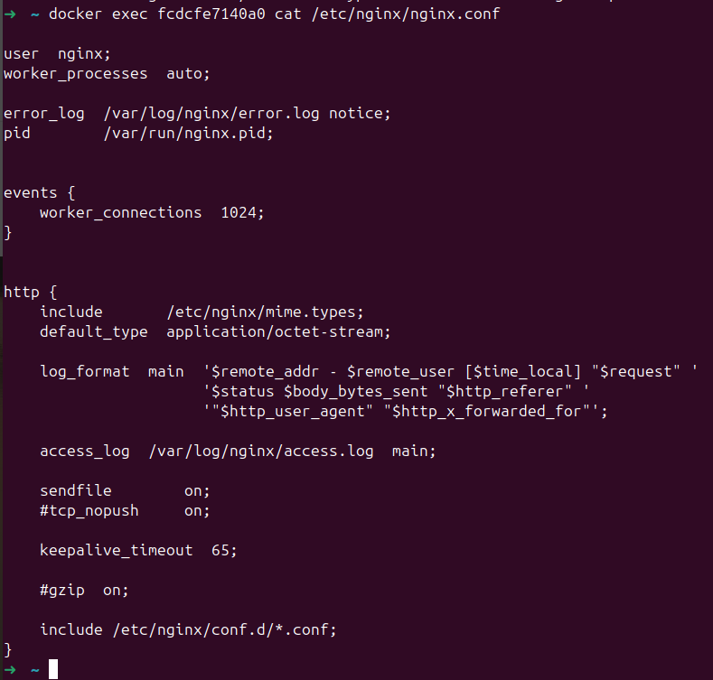

### Создём на локальной машине файл *nginx.conf* и настраиваем в нём по пути */status* отдачу страницы статуса сервера **nginx**

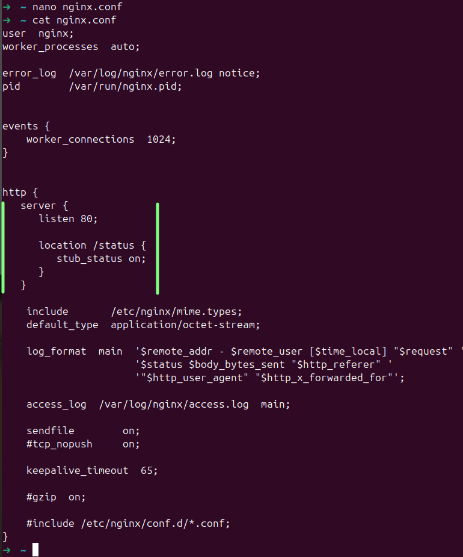

> - `http { ... }` — блок, обрабатывающий все настройки HTTP-серверов.
>
> - `server { ... }` — блок конфигурации, описывающий один сервер.
>
> - `listen 80;` — указывает, что сервер должен прослушивать входящие соединения на порту 80 (стандартный порт для HTTP-трафика).
>
> - `location /status { ... }` — блок, определяющий, как Nginx должен обрабатывать запросы, которые приходят по адресу /status. То есть, если кто-то зайдет на http://localhost/status, активируется эта часть конфигурации.
>
> - `stub_status on;` — включает модуль stub_status, позволяющий Nginx возвращать статистическую информацию о состоянии сервера. Когда эта директива включена, Nginx будет отображать статистику (например, количество активных соединений, количество запросов и т.д.), при обращении по адресу /status.

### Копируем созданный файл *nginx.conf* внутрь докер-образа через команду `docker cp`

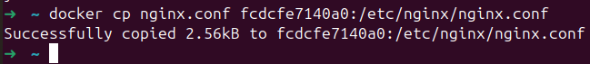

Как видим, файл успешно скопирован. А ранее существовавший файл *nginx.conf* перезаписан на новый.

### Перезапускаем **nginx** внутри докер-образа через команду `exec`

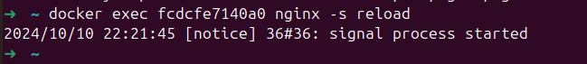

### Проверяем, что по адресу *localhost:80/status* отдается страничка со статусом сервера **nginx**

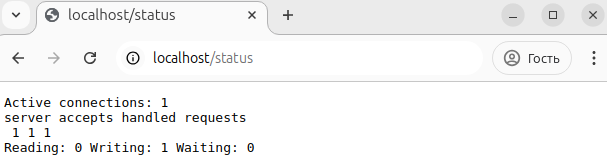

 - `Active connections: 1`: количество текущих активных соединений, установленных с сервером.

 - `server accepts handled requests`:
   - `accepts`: общее количество соединений, принятых сервером с момента его запуска.

   - `handled`: общее количество соединений, которые сервер успешно обработал.

   - `requests`: общее количество HTTP-запросов, которые были выполнены сервером.

 - `Reading: 0 Writing: 1 Waiting: 0`:
   - `Reading: 0`: количество соединений, которые сервер в данный момент читает. Значение 0 означает, что нет активных соединений, которые ожидают чтения данных от клиента.

   - `Writing: 1`: количество соединений, которые сервер в данный момент записывает данные. Значение 1 указывает на то, что одно соединение активно записывает данные (например, возвращает ответ клиенту).

   - `Waiting: 0`: количество соединений, которые находятся в состоянии ожидания, когда клиент подключен, но не отправляет запрос. Значение 0 указывает на то, что нет активных соединений, ожидающих отправки данных от клиента.

### Экспортируем контейнер в файл *container.tar* через команду `export`

Создаём файл *container.tar*, который содержит данные контейнера.

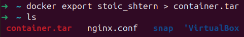

### Остановливаем контейнер

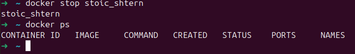

### Удаляем образ через `docker rmi [image_id|repository]`, не удаляя перед этим контейнеры

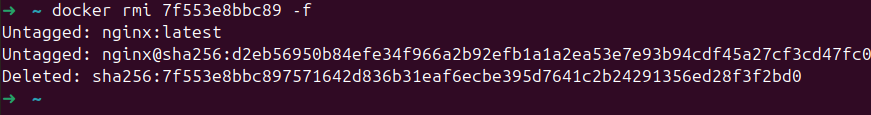

### Удаляем остановленный контейнер

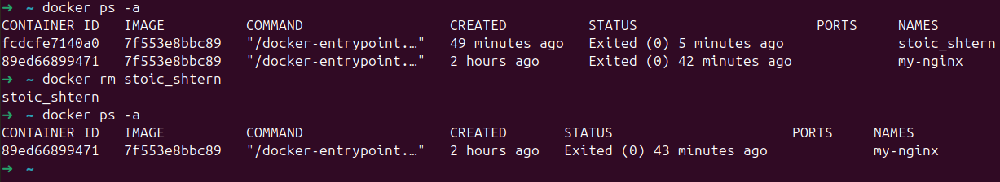

> `docker ps -a` показывает все контейнеры, которые когда-либо были созданы на системе, независимо от их состояния (запущены они или остановлены).

### Импортируем контейнер обратно через команду `import`

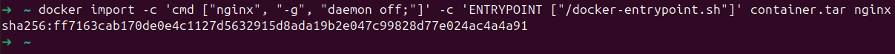

> - `-c 'cmd ["nginx", "-g", "daemon off;"]'`: флаг `-c` задает команду, которая будет выполнена при запуске контейнера. В данном случае:
>   - `nginx` — команда, которая запускает веб-сервер;
>   - `-g "daemon off;"` — Это аргумент, который передается Nginx, чтобы он не запускался в фоновом режиме, а оставался на переднем плане (это нужно для работы с Docker);
> - `-c 'ENTRYPOINT ["/docker-entrypoint.sh"]'`: флаг устанавливает точку входа для контейнера, указывая скрипт `docker-entrypoint.sh`, который будет выполняться при старте контейнера. Этот файл определяет, какие действия будут выполняться при запуске.
> - `nginx` — Это имя нового Docker-образа, который будет создан после импорта.

> Вывод — это хеш (SHA256), который идентифицирует созданный образ и позволяет Docker отслеживать и управлять образом.

### Запускаем импортированный контейнер

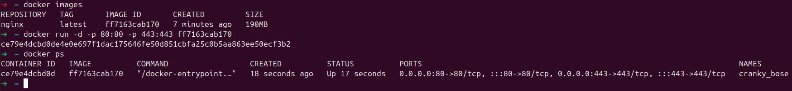

### Проверяем, что по адресу *localhost:80/status* отдаётся страничка со статусом сервера **nginx**

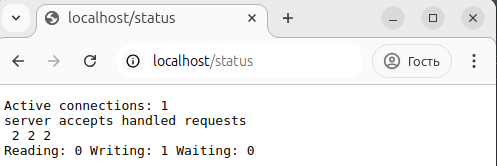

Как и раньше, мы можем видеть страницу со статусом **nginx**, только теперь изменились некоторые цифры.
