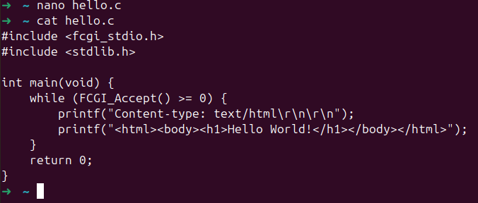
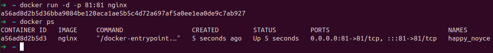
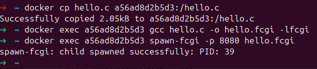
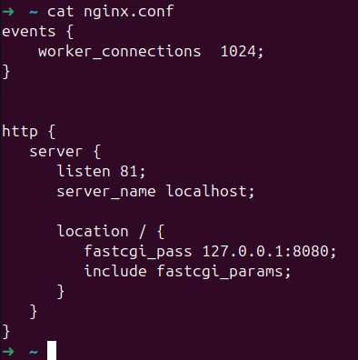
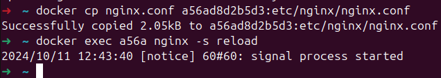
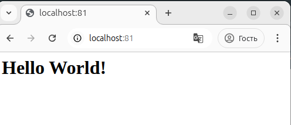

## Part 3. Мини веб-сервер

> English version: [../eng/Part3.md](Part3.md)

### Пишем мини-сервер на **C** и **FastCgi**, который будет возвращать простейшую страничку с надписью `Hello World!`

> **FastCGI** используется для повышения производительности серверов, он предоставляет интерфейс между веб-серверами и программами, написанными на C.

Создадим файл *.с* (в нашем случае *hello.c*), пропишем там следующий код:

Код в файле *hello.c* создаёт **FastCGI**-приложение, которое будет возвращать HTML-страницу с текстом `Hello World!`:

 -  `#include <fcgi_stdio.h>`: включаем заголовочный файл библиотеки **FastCGI**, который содержит необходимые функции для работы с **FastCGI**-протоколом, такие как `FCGI_Accept()`. **FastCGI** работает как интерфейс между программой и веб-сервером.

 - `while (FCGI_Accept() >= 0)`: цикл запускается каждый раз, когда сервер принимает новый запрос. Функция `FCGI_Accept()` возвращает 0 или больше, когда приходит новый запрос, и -1, если происходит ошибка.
   - `FCGI_Accept()` ждёт входящий запрос от клиента (обычно это запросы на странице). Когда запрос поступает, она открывает каналы ввода и вывода, как если бы программа общалась с веб-сервером через стандартный ввод/вывод.

 - `printf("Content-type: text/html\r\n\r\n");`: первая строка, отправляемая в ответ на запрос. Она сообщает браузеру, что возвращаемый контент — это HTML (тип контента *text/html*).

 - `printf("<html><body><h1>Hello World!</h1></body></html>");`: отправляем тело HTTP-ответа — HTML-код. Теги:
   - `<html>`: тег для HTML-документа. Весь HTML-код страницы начинается с тега <html> и заканчивается тегом </html>. Тег указывает браузеру, что документ завершён и больше не нужно ожидать новых элементов.
   - `<body>`: тег для тела HTML-документа. Всё, что между тегами `<body>` и `</body>`, будет отображаться на странице в бруазере.
   - `<h1>`: тег заголовка первого уровня в HTML.

### Запускаем написанный мини-сервер через `spawn-fcgi` на порту 8080

Запускаем новый контейнер с портами 81 (если порты будут 80, то сервер не запустится).

В контейнере обновляем пакеты, устанавливаем библиотеки и утилиты *libfcgi-dev*, *libfcgi0ldbl*, *spawn-fcgi* и *gcc*, необходимые для компиляции и запуска **FastCGI** программы:

 - `docker exec -it [container ID] apt update`
 - `docker exec -it [container ID] apt upgrade -y`
 - `docker exec -it [container ID] apt install -y libfcgi-dev libfcgi0ldbl spawn-fcgi gcc`

Когда контейнер готов, копируем в него файл *hello.c* и компилируем с флагом `-lfcgi` для подключения библиотеки **FastCGI**. Получаем исполняемый файл *hello.fcgi*, который будет отвечать на запросы через **FastCGI**.

> Если запустить эту команду с флагом `-n`, то она запустится в интерактивном режиме.

### Пишем свой *nginx.conf*, который будет проксировать все запросы с 81 порта на 127.0.0.1:8080

**Чтобы выполнить это задание, нужно установить **Nginx**: `sudo apt install nginx`**

> **Проксировать** — перенаправлять запросы от одного сервера или клиента на другой сервер через специальный промежуточный сервер, который называется прокси-сервером. В контексте веб-серверов, проксирование обычно означает, что один сервер (в нашем случае **nginx**) принимает запросы от клиента (например, браузера) и передает их другому серверу (в нашем случае приложению на **FastCGI**), который уже обрабатывает эти запросы и возвращает ответ.

Переписываем наш *nginx.conf* следующим образом:

  - `fastcgi_pass 127.0.0.1:8080` — это директива, которая указывает **Nginx** пересылать запросы, пришедшие на этот сервер, **FastCGI**-серверу, работающему на 127.0.0.1 (*localhost*) на порту 8080. Это значит, что запросы будут перенаправлены на сервер, который работает с **FastCGI** на указанном IP и порту.
  -  `include fastcgi_params` — включает файл *fastcgi_params*, в котором определены стандартные параметры **FastCGI** для взаимодействия **Nginx** и **FastCGI**-серверов. Этот файл содержит переменные окружения, такие как *SCRIPT_FILENAME* и *QUERY_STRING*, которые нужны для корректной работы **FastCGI**.

Копируем файл *nginx.conf* **в контейнер** в папку `/etc/nginx/` (это стандартное место, где хранятся конфигурационные файлы Nginx в операционных системах на базе **Linux**) и перезапустим `nginx`:

Теперь у нас есть сервер на порту 81 для проксирования запросов на **FastCGI**-сервер, который будет работать на порту 8080.

### Проверяем, что в браузере по `localhost:81` отдается написанная нами страничка

Открываем в браузере страницу `localhost:81` и видим:

---

## Навигация

↑ [README_ru](../../README_ru.md)

← [Part 2. Операции с контейнером](Part2_ru.md)

→ [Part 4. Свой докер](Part4_ru.md)

---