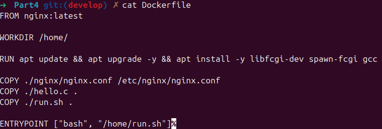
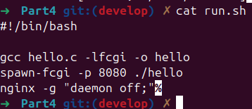
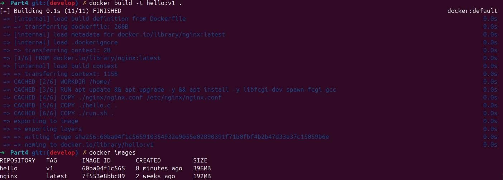
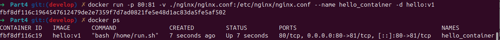
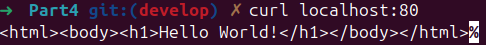
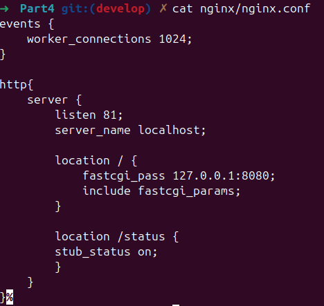
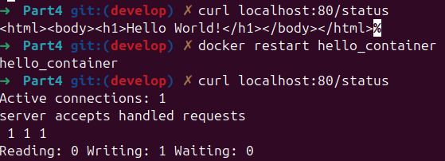

## Part 4. Свой докер

> English version: [../eng/Part4.md](Part4.md)

### Пишем свой докер-образ

Итак, наш докер-образ должен:
 1) собирать исходники мини-сервера на **FastCgi** из [Части 3](#part-3-мини-веб-сервер);
 2) запускать его на 8080 порту;
 3) копировать внутрь образа написанный *./nginx/nginx.conf*;
 4) запускать **nginx**.

  - `FROM nginx:latest` — указывает, что базовым образом будет официальный образ **Nginx** с тегом *latest*. Это означает, что будет использован последний доступный на момент сборки образ **Nginx**.

  - `WORKDIR /home/` — задает рабочую директорию внутри контейнера. Все последующие команды (например, копирование файлов или сборка) будут выполняться в этой директории.

  - `RUN apt update && apt upgrade -y && apt install -y libfcgi-dev libfcgi0ldbl spawn-fcgi gcc` — устанавливает в контейнер необхродимые пакеты.

  - `COPY ...` — копирует необходимые файлы из указанной локальной директории на хосте в контейнер.

  - `RUN gcc /usr/src/app/hello.c -o /usr/src/app/hello.fcgi -lfcgi` — компилирует файл `hello.c` в исполняемый файл `hello.fcgi` с использованием **FastCGI**-библиотеки *libfcgi*.

  - `ENTRYPOINT ["bash", "/home/run.sh"]` — указывает команду, которая будет выполнена при запуске контейнера. Здесь это запуск оболочки *bash* для выполнения скрипта */home/run.sh*.

Кроме того, создаём файл *run.sh*:

  - `gcc hello.c -lfcgi -o hello` — компилирует программу.
  
  - `spawn-fcgi -p 8080 ./hello` — запускает программу *hello* в качестве **FastCGI**-приложения, привязывая его к порту 8080. `spawn-fcgi` создает процесс, который будет обрабатывать запросы **FastCGI**, поступающие на этот порт.
  
  - `nginx -g "daemon off;"` — запускает **Nginx** с параметром `daemon off;`, что не позволяет ему работать в фоновом режиме. Это необходимо для того, чтобы контейнер не завершался после запуска **Nginx**.

### Соберём написанный докер-образ через `docker build`, при этом указав имя и тег; затем проверим через `docker images`, что всё собралось корректно

`docker build -t hello:v1 .`:

  - `-t` — задаёт имя образа;
  - `hello` — имя образа;
  - `:v1` — тег (версия первая);
  - `.` — указывает на текущую директорию как контекст сборки.
  
  > **Контекст сборки** — это набор файлов, которые **Docker** отправляет на демона **Docker** для выполнения сборки. Это могут быть файлы, такие как *Dockerfile*, файлы кода, конфигурации, библиотеки и другие ресурсы, которые нужны для создания образа.

### Запускаем собранный докер-образ с маппингом 81 порта на 80 на локальной машине и маппингом папки *./nginx* внутрь контейнера по адресу, где лежат конфигурационные файлы **nginx**'а

  - `-p 80:81` — пробрасывает порты между хостом и контейнером. Внешний (хостовый) порт 80 сопоставляется с внутренним портом 81 контейнера. Это значит, что запросы на порт 80 хост-машины будут перенаправлены на порт 81 внутри контейнера (на котором запущен **Nginx**).

  - `-v ./nginx/nginx.conf:/etc/nginx/nginx.conf` — монтирует файл с хоста в контейнер. Файл *nginx.conf* перезаписывает стандартный файл конфигурации **Nginx** в контейнере, и контейнер будет использовать наш файл конфигурации **Nginx**, который находится на хосте.

  - `--name hello_container` — задает имя контейнера (`hello_container`).

  - `-d` — опция запуска контейнера в фоновом режиме (`detached mode`).
  
  - `hello:v1` — имя и тег образа, на основе которого создается контейнер.

### Проверяем, что по `localhost:80` доступна страничка написанного мини-сервера

### Дописываем в *./nginx/nginx.conf* проксирование странички */status*, по которой надо отдавать статус сервера **nginx**.

### Перезапускаем докер-образ и проверяем, что теперь по *localhost:80/status* отдается страничка со статусом **nginx**

*Если всё будет сделано верно, то после сохранения файла и перезапуска контейнера конфигурационный файл внутри докер-образа должен обновиться самостоятельно без лишних действий*.

До обновления контейнера по адресу *localhost:80/status* возвращалась страница с текстом `Hello World!`, так как в предыдущем файле nginx.conf было указано, что при любом запросе к *localhost:80/* должна возвращаться эта страница. После изменений в *nginx.conf*, по запросу *localhost:80/status* теперь возвращается страница со статусом **nginx**.

---