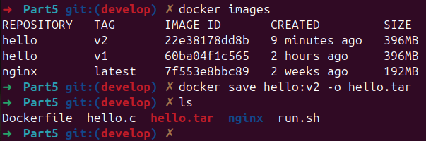
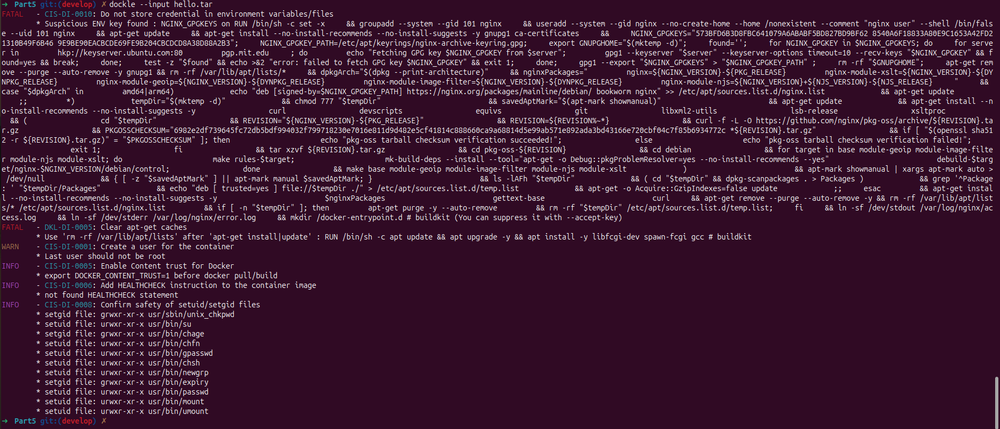
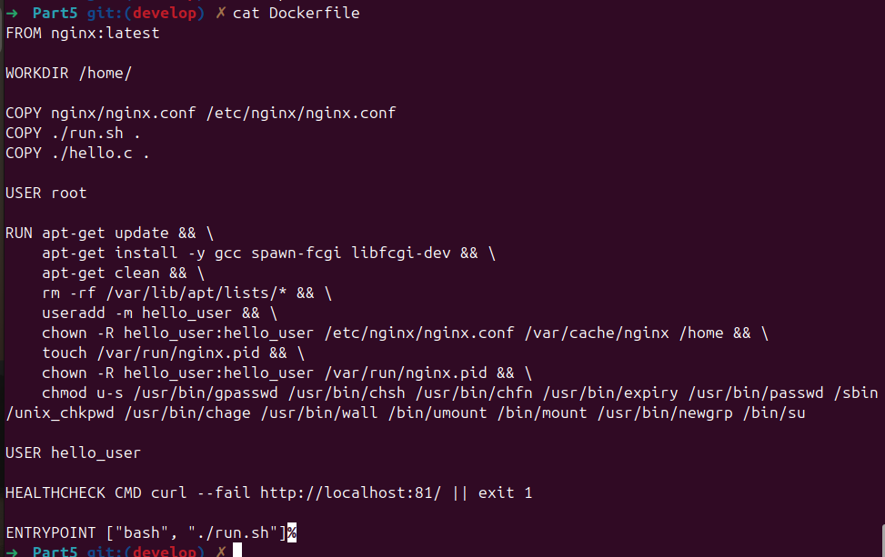
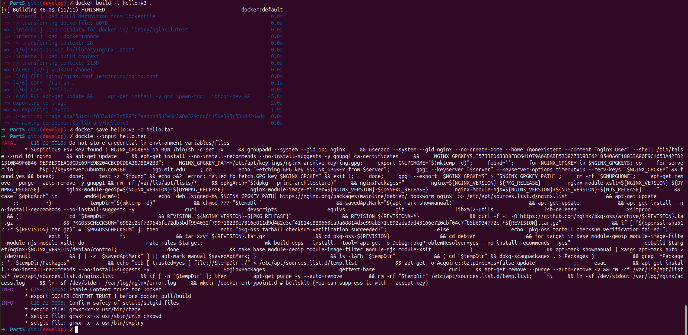

## Part 5. Dockle

> English version: [Part5.md](../eng/Part5.md)

## 5.1. Проверка образа с помощью Dockle

Для проверки безопасности Docker-образа используется утилита `Dockle`.

Соберём образ из файлов [предыдущей части](Part4_ru.md) и сохраним его в архив:

```bash
docker build -t hello:v2 .
docker save hello:v2 -o hello.tar
```



Запустим сканирование:

```bash
dockle --input hello.tar
```



В результате проверки были обнаружены:

* ошибки (*FATAL*);
* предупреждения (*WARN*);
* рекомендации (*INFO*).

Основные замечания касались запуска контейнера от пользователя `root`, отсутствия очистки кэша `apt` и дополнительных рекомендаций по безопасности образа.

---

## 5.2. Исправление замечаний Dockle

Для устранения ошибок и предупреждений внесём изменения в `Dockerfile`.



В обновлённой версии:

* очищается кэш `apt` после установки пакетов;
* создаётся отдельный пользователь `hello_user`;
* настраиваются права доступа для файлов и директорий Nginx;
* удаляются SUID-биты у системных утилит;
* добавляется инструкция `HEALTHCHECK`;
* запуск контейнера выполняется от имени непривилегированного пользователя.

После внесения изменений пересоберём образ и повторно выполним проверку.

```bash
docker build -t hello:v3 .
dockle hello:v3
```



После исправлений ошибки и предупреждения отсутствуют. В отчёте Dockle остаются только информационные рекомендации.

> Файл образа с исправлениями, сделанными в этой части: [src/history/Part5/Dockerfile](../../src/history/Part5/Dockerfile)

> Используется тот же [срипт для запуска приложения](../../src/final/run.sh) и тот же [файл `nginx.conf`](../../src/final/run.sh), что и в [Части 4](Part4_ru.md): 

---

## Итог

Docker-образ был проверен с помощью `Dockle` и доработан с учётом замечаний по безопасности. Настроен запуск от непривилегированного пользователя, добавлена проверка состояния контейнера и оптимизирована конфигурация образа.

---

## Навигация

↑ [README_ru](../../README_ru.md)

← [Part 4. Свой докер](Part4_ru.md)

→ [Part 6. Базовый Docker Compose](Part6_ru.md)

---