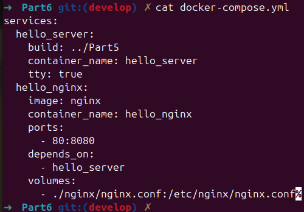
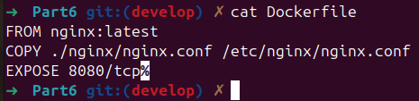
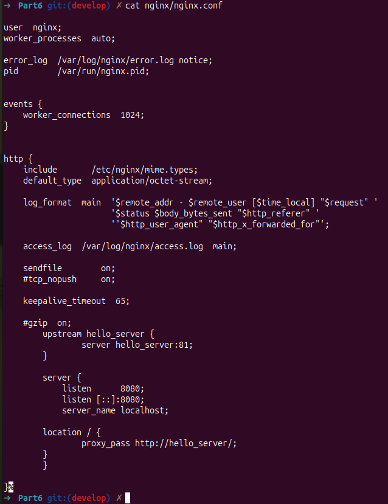
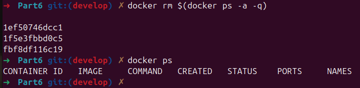
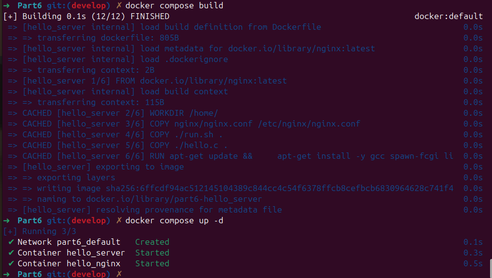
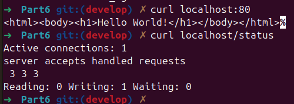

## Part 6. Базовый Docker Compose

> English version: [../eng/Part6.md](Part6.md)

### Пишем файл *docker-compose.yml*, мапим 8080 порт второго контейнера на 80 порт локальной машины

С помощью файла *docker-compose.yml* поднимаем два докер-контейнера:

 1) Докер-контейнер из [Части 5](#part-5-инструмент-dockle).
 2) Докер-контейнер с **nginx**, который будет проксировать все запросы с 8080 порта на 81 порт первого контейнера.

Также напишем *Dockerfile* в текущей папке (*Part6*):

И, конечно, напишем файл *nginx.conf*:

### Останавливаем все запущенные контейнеры

А ещё лучше — удалим!

Команда `docker rm $(docker ps -a -q)` удаляет все контейнеры, как работающие, так и остановленные.

### Собираем и запускаем проект с помощью команд `docker-compose build` и `docker-compose up`

> `-d` позволяет контейнерам работать в фоновом режиме.
>
> Если не поставить этот флаг, управление терминалом после выолнения команды не вернётся, потому что `docker-compose up` запустит сервисы в режиме *foreground* (на переднем плане), что означает, что все логи контейнеров будут отображаться в текущем терминале, и он будет заблокирован, пока контейнеры работают.

### Проверяем, что в браузере по *localhost:80* отдается написанная нами страничка

В конце не забудем удалить все ненужные образы и контейнеры в целях экономии памяти.

---

## Навигация

↑ [README_ru](../../README_ru.md)

← [Part 5. Dockle](Part5_ru.md)

---